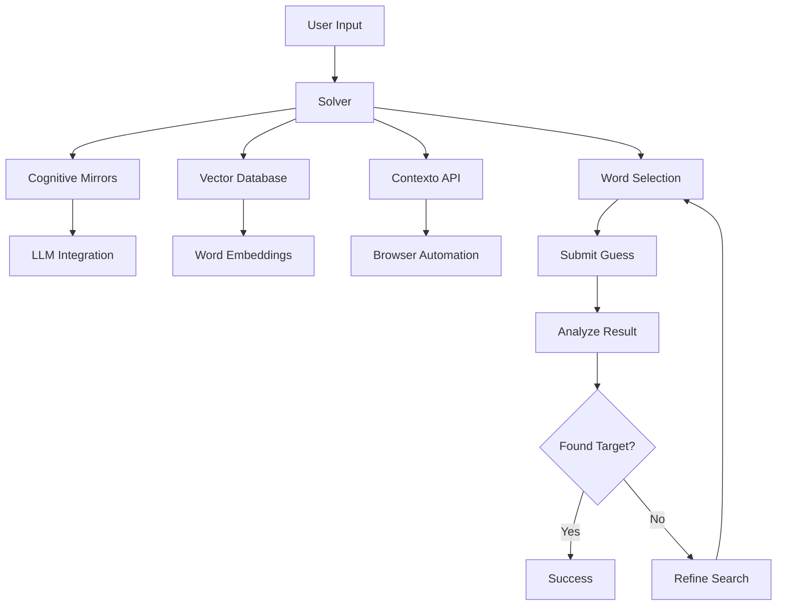
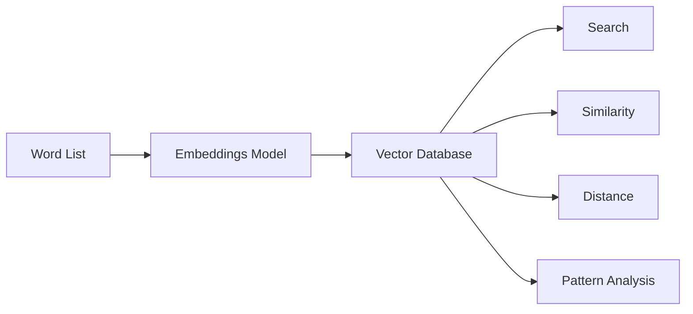
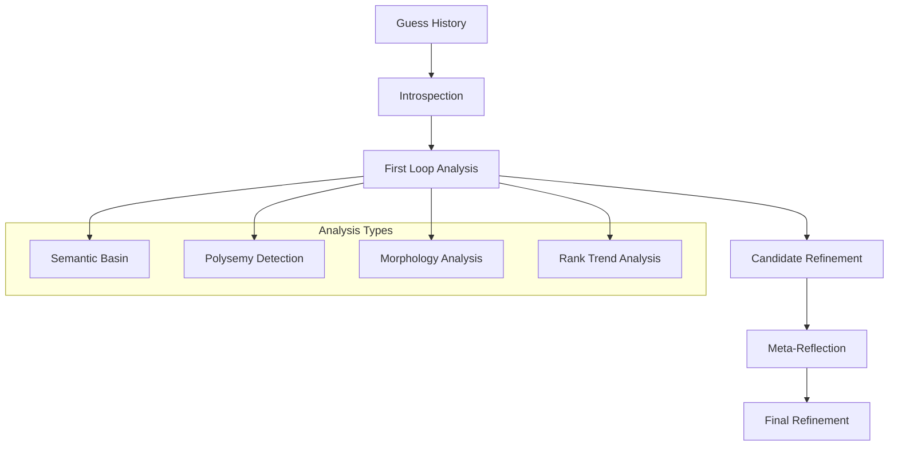

# 🎯 Contexto-Crusher

[](https://www.python.org/downloads/)
[](https://opensource.org/licenses/MIT)

An intelligent solver for the [Contexto](https://contexto.me/) word guessing game using semantic embeddings, cognitive mirrors, and rank-optimized word selection.

## What is Contexto?

[Contexto](https://contexto.me/) is a daily word guessing game where players try to guess a hidden target word. Unlike traditional word games:

- Each guess is ranked based on its semantic similarity to the target word
- Lower ranks mean closer to the target (rank 1 is the target word itself)
- The goal is to find the target word in as few guesses as possible

For example, if the target word is "ocean", guessing "sea" might get rank 10 (very close), while "mountain" might get rank 5000 (far away).

## Project Overview

Contexto-Crusher is an AI-powered solver that uses advanced natural language processing techniques to solve Contexto puzzles efficiently. It combines vector embeddings, cognitive reflection, and rank-optimized word selection to progressively narrow down the semantic space and find the target word.

### Key Features

- 🧠 **Cognitive Mirrors**: Double-loop reflection system that analyzes guess patterns
- 📊 **Rank Optimization**: Prioritizes words likely to achieve better ranks
- 🔍 **Vector Search**: Uses semantic embeddings to find related words
- 🤖 **LLM Integration**: Optional integration with language models for enhanced reasoning
- 🌐 **Browser Automation**: Interacts directly with the Contexto website

### System Architecture



## Technical Approach

Contexto-Crusher employs a sophisticated multi-stage approach to solve Contexto puzzles:

### 1. Vector Embeddings

We use semantic word embeddings to represent words in a high-dimensional vector space where similar words are closer together. This allows us to:

- Search for semantically related words
- Estimate the target word's position based on previous guesses
- Measure semantic distance between words

### 2. Cognitive Mirrors

Our unique "Cognitive Mirrors" system implements a double-loop reflection process:

- **First Loop**: Analyzes guess history and ranks to identify patterns
- **Second Loop**: Meta-reflection that critiques the first analysis
- **Rank-Based Strategy**: Adapts search strategy based on current best rank

This approach mimics human reasoning by continuously refining its understanding of the semantic space.

### 3. Rank Optimization

The system places heavy emphasis on rank information:

- Weights words by their ranks (lower ranks get higher weights)
- Identifies semantic areas that yield good vs. poor ranks
- Dynamically adjusts search strategy based on rank progress
- Predicts potential rank improvements for candidate words

### 4. LLM Integration

The system can optionally leverage large language models to enhance its reasoning capabilities:

- Analyzes semantic patterns in guess history
- Generates hypotheses about the target word's domain
- Recommends words with detailed reasoning
- Focuses on rank improvement in its analysis

## Installation

### Prerequisites

- Python 3.8+
- Playwright for browser automation
- Qdrant for vector database
- Optional: OpenAI API key for LLM integration

### Setup

1. Clone the repository:
   ```bash
   git clone https://github.com/JtPerez-Acle/contexto-crusher.git
   cd contexto-crusher
   ```

2. Install dependencies:
   ```bash
   pip install -r requirements.txt
   ```

3. Install Playwright browsers:
   ```bash
   playwright install
   ```

4. Set up environment variables (optional for LLM integration):
   ```bash
   export OPENAI_API_KEY=your_api_key_here
   ```

## Usage

### Basic Usage

Run the solver with default settings:

```bash
python crush.py
```

This will:
- Start with the word "thing" as the initial guess
- Use a maximum of 50 turns
- Run in headless mode (no visible browser)
- Use the default word list (20k.txt)

### Command-line Options

```bash
python crush.py --help
```

Available options:

- `--initial-word TEXT`: Specify a custom starting word
- `--max-turns INT`: Maximum number of turns (default: 50)
- `--no-headless`: Run with visible browser
- `--force-rebuild`: Force rebuild the vector index
- `--word-list PATH`: Path to custom word list file

### Examples

Solve with a custom starting word:
```bash
python crush.py --initial-word "computer"
```

Run with visible browser and fewer turns:
```bash
python crush.py --no-headless --max-turns 30
```

Rebuild the vector index with a custom word list:
```bash
python crush.py --force-rebuild --word-list data/custom_words.txt
```

## Components

Contexto-Crusher consists of several key components that work together:

### Vector Database (`vector_db.py`)

The vector database manages word embeddings and provides semantic search capabilities:

- Uses Qdrant as the underlying vector database
- Stores embeddings for 20,000+ common English words
- Provides semantic search functionality
- Analyzes patterns in guess results



### Solver (`solver.py`)

The core solving engine that coordinates the overall solution strategy:

- Manages the solving process from start to finish
- Proposes candidate words using multiple strategies
- Filters candidates to remove abbreviations and short words
- Estimates the target vector based on guess history
- Selects the best candidate word to try next

### Cognitive Mirrors (`cognitive_mirrors.py`)

Implements the double-loop reflection system:

- Generates introspective questions based on guess history
- Analyzes semantic basins, polysemy, and morphology
- Performs detailed rank trend analysis
- Provides meta-reflection on the solving process
- Identifies poor semantic areas to avoid



### LLM Integration (`llm_integration.py`)

Optional integration with large language models:

- Connects to OpenAI API
- Formats prompts with rank-focused instructions
- Analyzes guess patterns and semantic relationships
- Recommends words with detailed reasoning
- Predicts potential rank improvements

### Contexto API (`contexto_api.py`)

Handles interaction with the Contexto website:

- Uses Playwright for browser automation
- Navigates to the daily puzzle
- Submits guesses and retrieves ranks
- Parses results from the webpage

## Algorithm Details

### Word Selection Strategy

Contexto-Crusher uses a sophisticated multi-strategy approach to select words:

1. **Initial Guess**: Starts with "thing" (a semantically central word)

2. **Candidate Generation**:
   - Estimates target vector based on weighted history
   - Uses best words from history as search queries
   - Tries combinations of best words
   - Explores general semantic fields

3. **Cognitive Processing**:
   - Analyzes guess history for patterns
   - Identifies semantic basins and polysemy
   - Performs rank trend analysis
   - Generates meta-reflections

4. **Candidate Filtering**:
   - Removes already tried words
   - Filters out abbreviations and very short words
   - Ensures words contain vowels
   - Prioritizes words likely to improve rank

5. **Final Selection**:
   - Uses LLM recommendations when available
   - Falls back to vector similarity when needed
   - Adapts strategy based on current best rank

### Rank Optimization Techniques

The system employs several techniques to optimize for better ranks:

1. **Weighted Vector Estimation**:
   - Words with better ranks get higher weights
   - Very distant words get negative weights (move away from them)
   - Weights are normalized and used to compute a weighted average

2. **Rank-Based Strategy Adaptation**:
   - For ranks < 50: Focus intensely on similar words
   - For ranks < 100: Focus on the semantic area
   - For ranks < 500: Balance exploration and exploitation
   - For ranks > 500: Prioritize diverse semantic areas

3. **Rank Trend Analysis**:
   - Tracks rank changes over time
   - Identifies significant improvements and deteriorations
   - Analyzes recent trends (improving, worsening, fluctuating)
   - Recommends strategy adjustments based on trends

4. **LLM Rank-Focused Prompting**:
   - Instructs the LLM to prioritize rank improvement
   - Provides detailed rank analysis in prompts
   - Requests rank predictions for recommended words
   - Emphasizes words with the best ranks in analysis

### Filtering Techniques

To improve efficiency and avoid wasting guesses, the system filters candidates:

- **Already Tried**: Removes words already guessed
- **Length Filter**: Removes words shorter than 3 characters
- **Abbreviation Filter**: Removes likely abbreviations (all caps, contains periods)
- **Vowel Check**: Ensures words contain at least one vowel
- **Fallback**: If filtering removes all candidates, falls back to basic filtering

## Performance

Contexto-Crusher typically solves puzzles in 15-30 guesses, with performance varying based on the target word's semantic properties.

### Optimization Techniques

Several optimizations improve the system's performance:

- **Curated Word List**: Uses a focused list of 20,000 common English words
- **Aggressive Weighting**: Heavily weights words with good ranks
- **Negative Weighting**: Moves away from semantic areas with poor ranks
- **Double-Loop Critique**: Refines understanding through meta-reflection
- **Dynamic Introspection**: Generates questions based on current state

### Performance Factors

Factors that affect solving performance:

- **Target Word Frequency**: Common words are easier to find
- **Semantic Ambiguity**: Words with multiple meanings are harder
- **Semantic Centrality**: Words in dense semantic spaces are easier
- **Part of Speech**: Nouns are typically easier than adjectives or verbs

## Contributing

Contributions to Contexto-Crusher are welcome! Here's how you can contribute:

1. Fork the repository
2. Create a feature branch: `git checkout -b feature/amazing-feature`
3. Commit your changes: `git commit -m 'Add amazing feature'`
4. Push to the branch: `git push origin feature/amazing-feature`
5. Open a Pull Request

### Development Setup

For development:

1. Set up a virtual environment:
   ```bash
   python -m venv venv
   source venv/bin/activate  # On Windows: venv\Scripts\activate
   ```

2. Install development dependencies:
   ```bash
   pip install -r requirements-dev.txt
   ```

3. Run tests:
   ```bash
   pytest
   ```

## License

This project is licensed under the MIT License - see the LICENSE file for details.

## Acknowledgments

- [Contexto](https://contexto.me/) for creating the original game
- [Qdrant](https://qdrant.tech/) for the vector database
- [Playwright](https://playwright.dev/) for browser automation
- [OpenAI](https://openai.com/) for the API used in LLM integration
